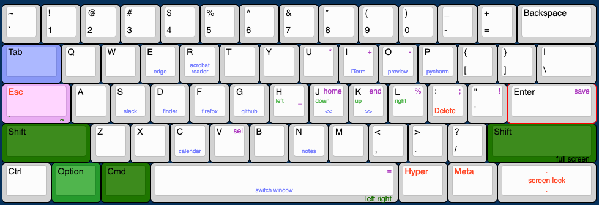

## Shawn's dotfiles
<div align="center">
<h4>To setup and sync settings across devices</h4>
</div>

Meaning of the files:
 - `dot` the main script, run `dot --help` for detail.
 - `config.zshrc` holds the common settings. Local settings must be placed in *~/.localrc*.
 - `bundels.txt` holds the commands to be installed when run `dot init`.

For heavy configuration app like vim, antibody... create a folder with this structure:
```text
module
├── aliases.zsh
├── config_dir_sample.symlink
├── config_file_sample.symlink
├── install.sh
└── path.zsh
```
- `*.symlink` will create a symbolic link to the targeted file/folder.
- `install.sh` will be run when **init** and **update**.
- `*.zsh` all the .zsh file will be sourced in the `.zshrc`
  - `aliases.zsh` holds the aliases for the app.
  - `path.zsh` holds command to append system path variable.
  - ...


### Installation
- Fork this repo to be able to customize and sync your settings.
- Beware of hardcode:
  1. installation path must be `~/.dotfiles`.
  1. some installation that can not be installed with the package manager, will be placed under `~/.locals`.
  1. git username and email will be set to mine, if not preconfigured.

Install with this command, but replace the repo with yours.
```shell script
git config --global core.autocrlf input
git clone -q https://github.com/tungph/dotfiles.git ~/.dotfiles && ~/.dotfiles/dot init
```

```shell
# With new user create
sudo adduser shawn
sudo usermod -aG sudo shawn
sudo echo "shawn ALL=(ALL) NOPASSWD:ALL" >> /etc/sudoers
sudo su - shawn
git clone -q https://github.com/tungph/dotfiles.git ~/.dotfiles && ~/.dotfiles/dot init
```
### Reference:
* My keyboard layout:

[edit online](http://www.keyboard-layout-editor.com/##@@=~%0A%60&=!%0A1&=%2F@%0A2&=%23%0A3&=$%0A4&=%25%0A5&=%5E%0A6&=%2F&%0A7&=*%0A8&=(%0A9&=)%0A0&=%2F_%0A-&=+%0A%2F=&_w:2%3B&=Backspace%3B&@_c=%23d6d6d6&t=%23007a51&w:1.5%3B&=Tab&_c=%23cccccc&t=%23000000%0A%0A%23c223db%0A%0A%0A%0A%0A%0A%0A%23007a51&fa@:0&:0&:0&:0&:0&:0&:0&:0&:0&:1%3B%3B&=Q%0A%0A1%0A%0A%0A%0A%0A%0A%0A%3E%3E&=W%0A%0A2%0A%0A%0A%0A%0A%0A%0A%3C%3C&_t=%23000000%0A%0A%23c223db%3B&=E%0A%0A3&=R%0A%0A4&=T%0A%0A5&=Y%0A%0A6&=U%0A%0A7&=I%0A%0A8&=O%0A%0A9&=P%0A%0A0&_t=%23000000%3B&=%7B%0A%5B&=%7D%0A%5D&_w:1.5%3B&=%7C%0A%5C%3B&@_c=%23f3d9ff&t=%23000000%0A%0A%238f1aa1&fa@:0&:0&:2%3B&w:1.75%3B&=Caps%0A%0AESC%0A%60%0A%0A%0A%0A~&_c=%23cccccc&t=%23000000%0A%0A%23c223db&f:3%3B&=A%0A%0A%5B&_f:3%3B&=S%0A%0A%7B&_f:3%3B&=D%0A%0A(&_f:3%3B&=F%0A%0A)&_f:3%3B&=G%0A%0A%7D&_f:3%3B&=H%0A%0A%5D&_t=%23000000%0A%0A%23c223db%0A%0A%0A%0A%0A%0A%0A%23007a51&fa@:0&:0&:0&:0&:0&:0&:0&:0&:0&:1%3B%3B&=J%0A%0A+%0A%0A%0A%0A%0A%0A%0A%3E%3E&=K%0A%0A-%0A%0A%0A%0A%0A%0A%0A%3C%3C&_t=%23000000%0A%0A%23c223db%3B&=L%0A%0A*&=%2F:%0A%2F%3B%0A%25&=%22%0A'%0A%2F=&_c=%23f6f7dc&t=%23000000%0A%0A%238f1aa1%0A%0A%0A%0A%0A%0A%0A%0A%238f9156&a:0&fa@:0&:0&:2&:0&:0&:0&:0&:0&:0&:1&:0%3B&w:2.25%3B&=Enter%0A%0Asave%0A%0AC%2F:%20up%0ACS%2F:%20down%0A%0A%0A%0A%0AS%2F:%20end%3B&@_t=%23000000&a:4&w:2.25%3B&=Shift&_c=%23cccccc%3B&=Z&=X&_t=%23000000%0A%0A%23c223db&f:3%3B&=C%0A%0A!&_t=%23000000%0A%0A%238f1aa1%3B&=V%0A%0Asel&_t=%23000000%3B&=B&_t=%23000000%0A%0A%238f1aa1%3B&=N%0A%0Adel&_t=%23000000%0A%0A%23c223db&f:3%3B&=M%0A%0A%2F_&_t=%23000000%3B&=%3C%0A,&=%3E%0A.&=%3F%0A%2F%2F&_w:2.75%3B&=Shift%3B&@_w:1.25%3B&=Ctrl&_w:1.25%3B&=Option&_c=%23f6f7dc&w:1.25%3B&=Cmd&_a:3&w:6.25%3B&=%0A%0A%0A%0ACS%2F:%20left%0AS%2F:%20right&_c=%23cccccc&a:4&w:1.25%3B&=Cmd&_w:1.25%3B&=Option&_a:7&w:1.25%3B&=&_w:1.25%3B&=)
### Acknowledgement
The philosophy and a lot of settings were copied from [Carlos' dotfiles](https://github.com/caarlos0/dotfiles).

test
